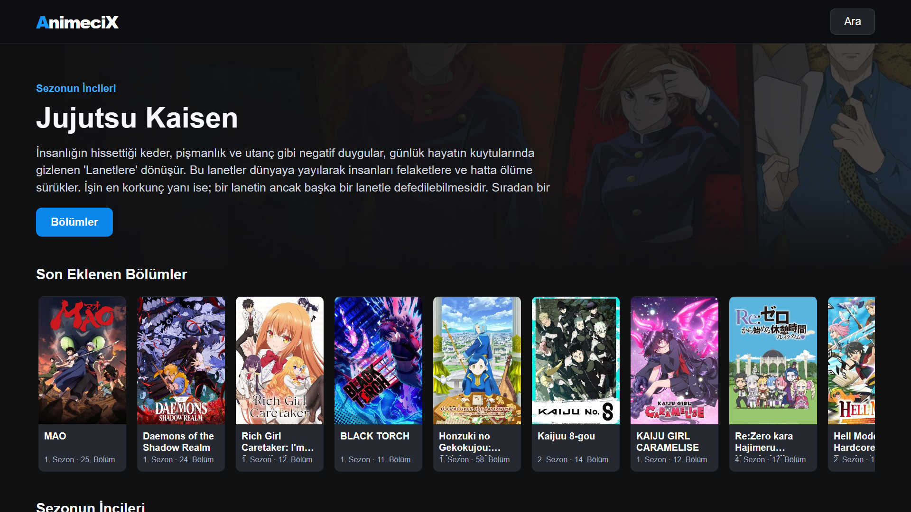

# AnimeciX Tizen TV

Samsung Tizen televizyonlar için hazırlanmış, kumandayla kullanılabilen bir AnimeciX istemcisi.

Uygulama; ana sayfa, arama, hesap girişi, kayıt, izleme geçmişi, kaldığın yerden devam etme, kaynak ve kalite seçimi ile TV kumandasına uygun video kontrollerini içerir. Sağ ve sol tuşları videoyu onar saniye sarar. Art arda basılan sarma komutları tek işlemde uygulanır; bu sayede eski televizyonlarda gereksiz tamponlama azaltılır.

Bu proje AnimeciX veya Samsung'un resmî uygulaması değildir. Herhangi bir video barındırmaz. İçeriklerin ve kullanılan hizmetlerin kurallarına uymak kullanıcının sorumluluğundadır.



## Özellikler

- Samsung Tizen 4.0 ve üzeri TV Web uygulaması
- Kumandayla tam yön tuşu ve odak kontrolü
- Anime arama ve bölüm listeleri
- Sezon bölüm listelerini TV'de önbelleğe alma
- Oynatıcıdan geri dönünce bölüm listesini otomatik açma
- E-posta ve şifreyle hesap girişi
- Hesaba bağlı izleme geçmişi
- Kaldığın yerden devam etme
- Hesap geçmişini TV'de yerel olarak saklama
- Kaynak ve kalite seçimi
- Oynat, duraklat, ileri sar ve geri sar kontrolleri
- İzleme konumunu TV'de saklama
- Hesap oturumunu bilgisayarda şifreli saklama

## Neden bilgisayarda küçük bir bağlantı servisi gerekiyor?

Tizen uygulamaları TV'de yerel bir uygulama adresinden çalışır. AnimeciX hesabının oturum çerezi bu adresten doğrudan okunamadığı için hesap girişi ve geçmiş eşitlemesi bilgisayardaki yerel servis üzerinden yapılır.

Servis yalnızca kurulum sırasında belirtilen TV IP adresinden ve aynı bilgisayardan gelen istekleri kabul eder. TV ile bilgisayar arasındaki istekler kurulumda üretilen AES-256-GCM anahtarıyla şifrelenir. Şifre, oturum çerezi ve üretilen anahtar Git deposuna yazılmaz.

Hesap eşitlemesi sırasında alınan geçmiş TV'de yerel olarak saklanır. Bilgisayar daha sonra kapalı olsa da kaldığın yerden devam etme kayıtları kullanılabilir. Yeni kayıtların web hesabına aktarılması için bağlantı servisi gerekir. Video oynatma başladıktan sonra yayın TV tarafından doğrudan kaynaktan alınır.

## Gerekenler

- Windows 10 veya Windows 11
- Node.js 20 veya üzeri
- Samsung TV ile aynı yerel ağ
- Developer Mode açık bir Samsung Tizen TV
- Tizen Studio
- Tizen Studio Package Manager içinden:
  - Web CLI
  - Samsung TV Extensions
  - Samsung Certificate Extension

Samsung'un resmî kurulum belgeleri:

- [Samsung TV SDK kurulumu](https://developer.samsung.com/smarttv/develop/getting-started/setting-up-sdk/installing-tv-sdk.html)
- [Sertifika profili oluşturma](https://developer.samsung.com/smarttv/develop/getting-started/setting-up-sdk/creating-certificates.html)
- [Tizen komut satırı kullanımı](https://developer.samsung.com/smarttv/develop/getting-started/using-sdk/command-line-interface.html)

Emülatör paketlerini kurmanız gerekmez. Fiziksel TV için Web CLI, TV Extensions ve Samsung Certificate Extension yeterlidir.

## TV'yi hazırlama

1. TV ve bilgisayarı aynı yerel ağa bağlayın.
2. TV'de `Apps` ekranını açın.
3. Kumandadan `1 2 3 4 5` tuşlarına basın.
4. Developer Mode'u açın.
5. Bilgisayarın yerel IPv4 adresini girin.
6. TV'yi tamamen kapatıp yeniden açın.
7. TV'nin IP adresini ağ ayarlarından not edin.

## Kurulum

Depoyu indirdikten sonra PowerShell'i proje klasöründe açın. Aşağıdaki komutta TV IP adresini kendi adresinizle değiştirin:

```powershell
powershell -ExecutionPolicy Bypass -File .\scripts\setup.ps1 -TvAddress 192.168.1.50
```

Bilgisayar adresi otomatik bulunamazsa iki adresi de verin:

```powershell
powershell -ExecutionPolicy Bypass -File .\scripts\setup.ps1 -TvAddress 192.168.1.50 -PcAddress 192.168.1.10
```

Kurulum betiği şunları yapar:

- TV ile bilgisayar için yeni veya mevcut yerel şifreleme anahtarını kullanır.
- `app/bridge-key.js` ve `app/bridge-config.js` dosyalarını oluşturur.
- Bağlantı servisini `%USERPROFILE%\Tools\AnimeciXTV` klasörüne kurar.
- Şifreli oturum verilerini `%LOCALAPPDATA%\AnimeciXTV` altında tutar.
- Servisi Windows oturumu açıldığında başlayacak şekilde kaydeder.
- Servisi başlatıp sağlık kontrolü yapar.

Windows Güvenlik Duvarı Node.js için izin isterse yalnızca özel ağlara izin verin.

## Samsung sertifikası

TV'ye uygulama yüklemek için kendi Samsung sertifikanız gerekir. Başka bir kullanıcının imzaladığı WGT dosyası çoğu TV'ye doğrudan kurulamaz.

1. Tizen Studio'da `Tools > Certificate Manager` bölümünü açın.
2. Yeni profil oluşturun ve `Samsung > TV` seçin.
3. Samsung hesabınızla oturum açarak author certificate oluşturun.
4. Distributor certificate aşamasında TV'nizin DUID değerini ekleyin.
5. Profil adını not edin. Aşağıdaki örneklerde profil adı `TV` olarak kullanılıyor.

Author certificate dosyanızı ve parolasını güvenli bir yerde yedekleyin. Aynı uygulamayı daha sonra güncellemek için aynı author certificate gerekir.

## Derleme ve TV'ye yükleme

Önce Tizen Studio araçlarını PATH'e ekleyin. Varsayılan kurulum için örnek:

```powershell
$env:Path += ";$env:USERPROFILE\tizen-studio\tools\ide\bin;$env:USERPROFILE\tizen-studio\tools"
```

TV'ye bağlanın:

```powershell
sdb connect 192.168.1.50:26101
sdb devices
```

Listede TV'nin yanında `device` yazmalıdır. Ardından uygulamayı derleyip kendi profilinizle imzalayın:

```powershell
tizen build-web -- .\app
tizen package -t wgt -s TV -- .\app\.buildResult
```

Oluşan paketi bulun:

```powershell
Get-ChildItem .\app\.buildResult\*.wgt
```

Paket adını aşağıdaki komuta yazıp kurun:

```powershell
tizen install -s 192.168.1.50:26101 -n AnimeciX.wgt -- .\app\.buildResult
tizen run -s 192.168.1.50:26101 -p pCVunngjf2.AnimeciX
```

Paket adı farklı oluşursa `-n` değerini çıkan dosya adıyla değiştirin.

## Kullanım

- Yön tuşları: Menü ve kartlar arasında gezinme
- Orta tuş: Seçme, oynatma ve duraklatma
- Sağ ve sol: Video sırasında on saniye ileri veya geri sarma
- Geri: Açık menüyü kapatma veya önceki ekrana dönme
- Play/Pause: Oynatma durumunu değiştirme
- Rewind/Fast Forward: On saniye geri veya ileri sarma

Video kaynağı zaman çizelgesi için gerçek storyboard görselleri sağlıyorsa sarma kartında ilgili kare gösterilir. Kaynak bu veriyi sağlamıyorsa kartta seçilen süre görünür.

## Güncelleme

Kaynakları yeniledikten sonra `setup.ps1` dosyasını tekrar çalıştırabilirsiniz. Mevcut yerel anahtar korunur. Daha sonra uygulamayı aynı author certificate ile yeniden paketleyip kurun. Aynı uygulama kimliği ve sertifika kullanıldığı sürece Tizen kurulumu güncelleme olarak uygulanır.

## Sorun giderme

### `sdb devices` TV'yi göstermiyor

- TV ve bilgisayarın aynı ağda olduğunu kontrol edin.
- Developer Mode ekranındaki bilgisayar IP adresini kontrol edin.
- TV'yi tamamen kapatıp açın.
- `sdb connect TV_IP:26101` komutunu yeniden çalıştırın.

### `closed` veya bağlantı reddedildi hatası

TV'nin Developer Mode'u kapanmış olabilir. Developer Mode'u açıp bilgisayar IP adresini tekrar girin ve TV'yi yeniden başlatın.

### Uygulama yüklenmiyor

- Samsung Certificate Extension'ın kurulu olduğunu kontrol edin.
- Distributor certificate içinde doğru TV DUID değerinin bulunduğunu kontrol edin.
- Device Manager'da TV için `Permit to install applications` işlemini uygulayın.
- Paketi kendi sertifika profilinizle yeniden oluşturun.

### Giriş veya geçmiş eşitlemesi çalışmıyor

Bilgisayarda şu adresi açın:

```text
http://127.0.0.1:48761/health
```

Yanıt `{"ready":true}` olmalıdır. Yanıt gelmiyorsa kurulumu tekrar çalıştırın. PC IP adresi değiştiyse uygulamayı tekrar paketleyip TV'ye kurmanız gerekir.

### Sağ ve sol tuşları videoyu sarmıyor

Video ekranında aşağı tuşuyla zaman çizelgesine gelin. Zaman çizelgesi odaktayken sağ ve sol tuşları sarma için kullanılır. Üst menü odaktayken aynı tuşlar Kaynak ve Kalite düğmeleri arasında dolaşır.
